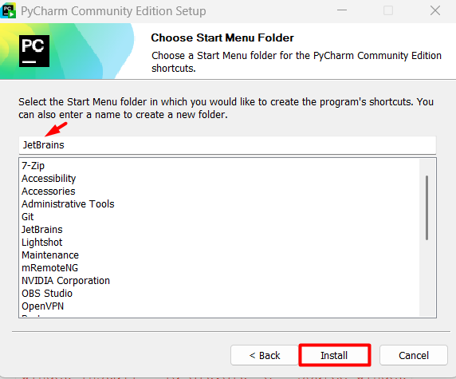

# Домашнее задание 1

1. Установите Python: https://www.python.org/downloads/.
   - 
   - **Обязательно поставьте галочку** "Add python.exe to PATH" и выберите "Install now".
     - 
   - После загрузки появится окно об успешной установке. Закройте его.
     - 
   - Проверьте, что Python установился: откройте консоль и введите `python`, нажмите Enter.
     - 
     - Если возникла ошибка, то возможно, вы не поставили галочку "Add python.exe to PATH", проще всего будет переустановить Python.
       > Python удаляется как приложение
     - Если Python Shell запустился, напишите `print('Hello World!')` и нажмите Enter, должна распечататься соответствующая строка.
     - 
2. Установите PyCharm Community Edition (кнопка загрузки находится внизу страницы под версией Professional): https://www.jetbrains.com/pycharm/download/.
   - 
   - 
   - При установке **поставьте галочки, как на изображении ниже!** Пункт Add "Open Folder as Project" опциональный.
   - 
   - 
3. Установите git: https://git-scm.com/downloads. **Не меняйте никаких пунктов!**
- 
- 

4. Зарегистрируйтесь или войдите в свою учетную запись на github: https://github.com/
5. Скопируйте ссылку на ваш профиль в Github вида https://github.com/username, где username - это ваш логин на Github.
    > Ссылка находится в адресной строке браузера
   - При сдаче дз, приложите данную ссылку

---

# Полезные материалы:

Часто задаваемые вопросы про Python (на английском, но можно перевести прямо в браузере)
- https://docs.python.org/3/faq/general.html

