# Домашнее задание 2

Домашнее задание состоит из 4 частей:
1. Настройка git
2. Создание проекта в PyCharm
3. Настройка .gitignore
4. Работа с файлами

---

### Часть 1: Настройка git

1. Откройте консоль git.

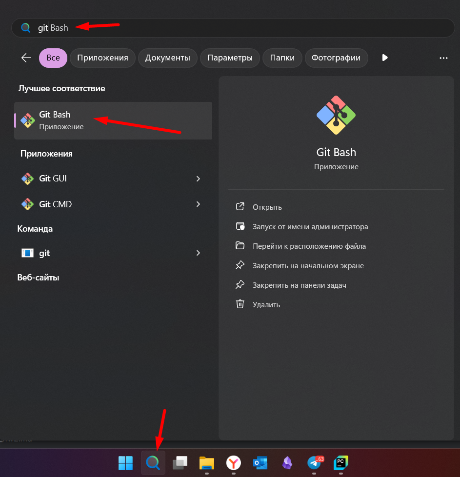

2. Измените имя пользователя в консоли с помощью команды:
```commandline
git config --global user.name "Здесь имя пользователя"
```

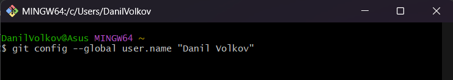

3. Измените почту пользователя на ту, которая указана в GitHub с помощью команды:
```commandline
git config --global user.email почта
```

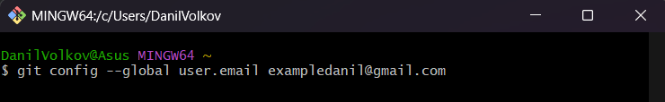

4. Проверьте установленные параметры с помощью команды:
```commandline
git config --list --show-origin
```

---

### Часть 2: Создание проекта в PyCharm

1. Откройте PyCharm.
2. Создайте новый проект.

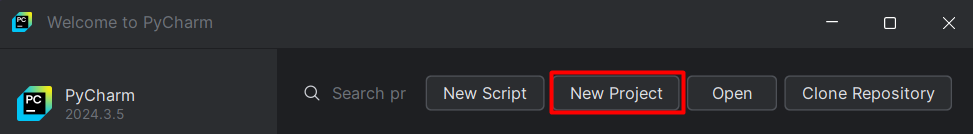

3. Введите название проекта `TestProject`, выберите существующую виртуальную среду.
После завершения всех настроек нажмите `Create`

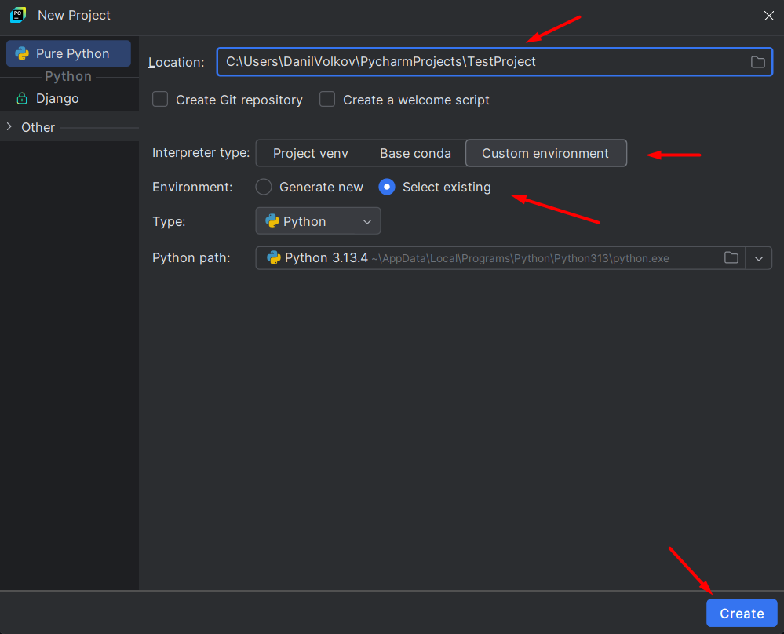

4. Проект должен выглядеть примерно как на изображении ниже.

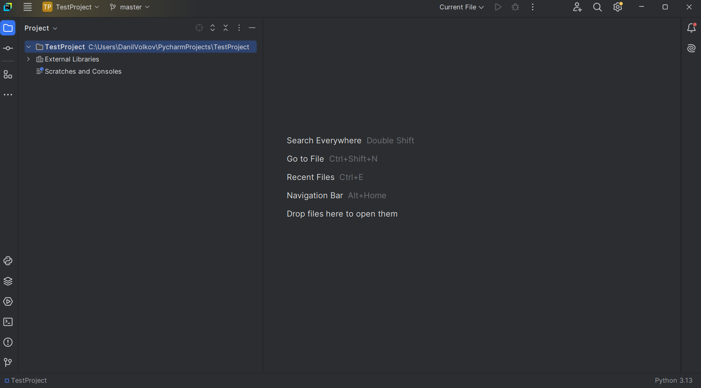

---

### Часть 3: Настройка .gitignore

1. Откройте консоль и проинициализируйте репозиторий командой `git init`

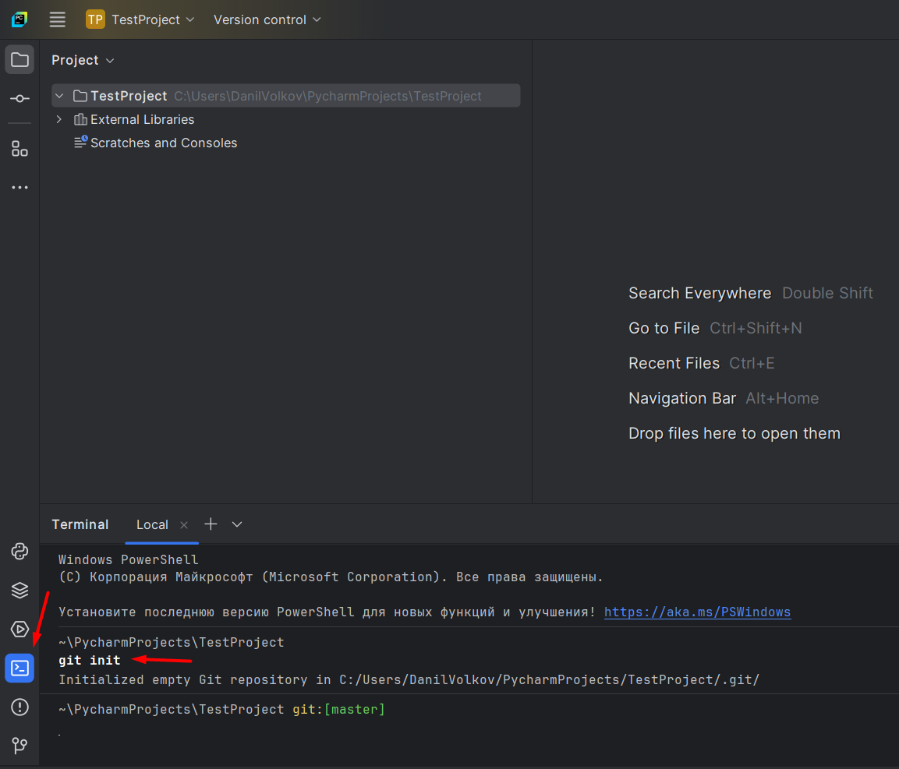

2. Нажмите правой кнопкой мыши на название проекта -> New -> File.

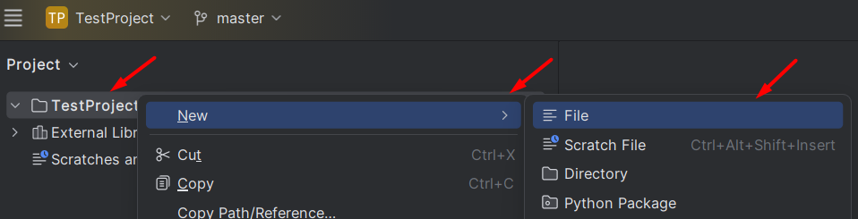

3. Введите название файла `.gitignore` и нажмите Enter.


4. Появится окно с вопросом - нужно ли добавить файлик в stage git. Нажмите `Add`

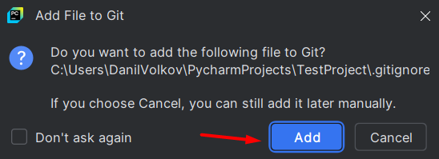

5. Введите в файле текст `.idea/`, чтобы убрать папку из отслеживаемых.

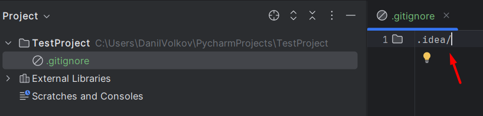

6. Откройте меню `Commit`

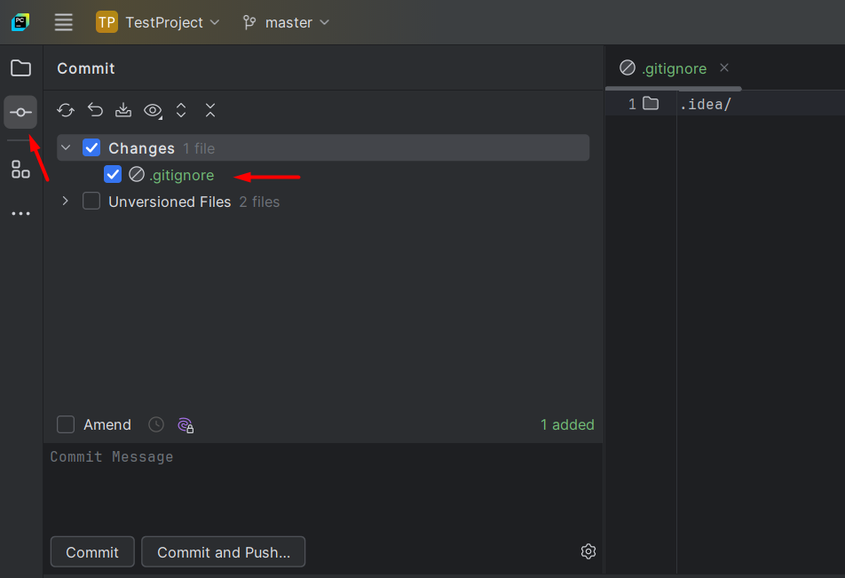

> Если меню нет - нажмите 3 точки и выберите его в списке.

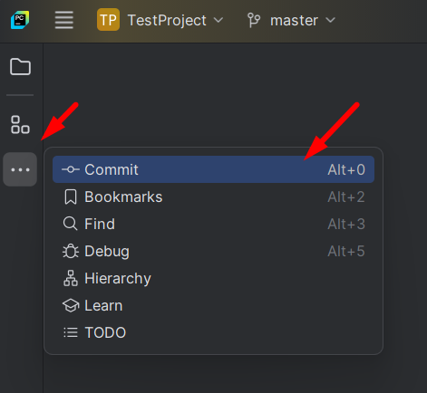

7. Перейдите в меню `Commit`, выделите все файлики, введите название коммита
`Add gitignore` и нажмите на кнопку `Commit`

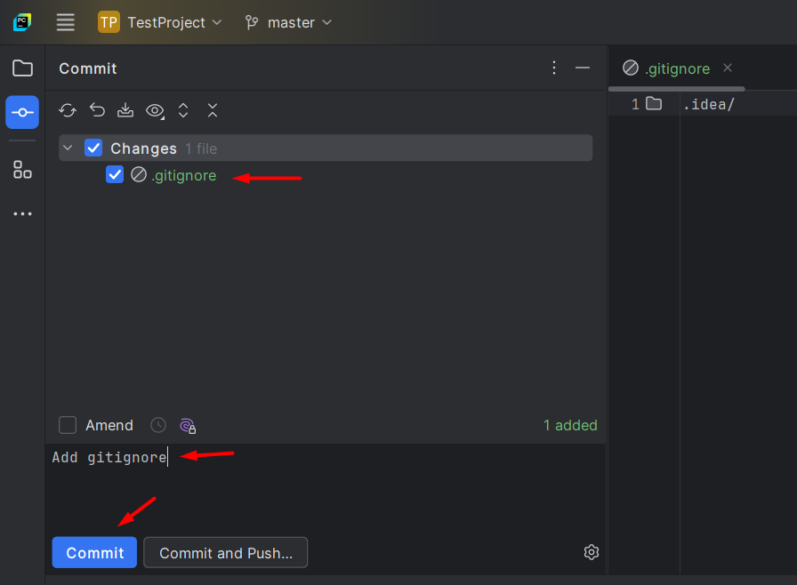

---

### Часть 4: Работа с файлами

1. Создайте новый файлик под названием `task1.txt`
Для этого нажмите правой кнопкой мыши на название папки и введите название.
2. Появится окно с вопросом - нужно ли добавить файлик в stage git. Нажмите `Add`

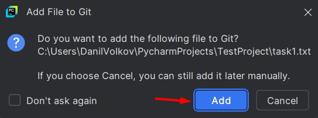

3. Перейдите в меню `Commit`, выделите файлик, введите название коммита `Add task1.txt`
и нажмите `Commit`.

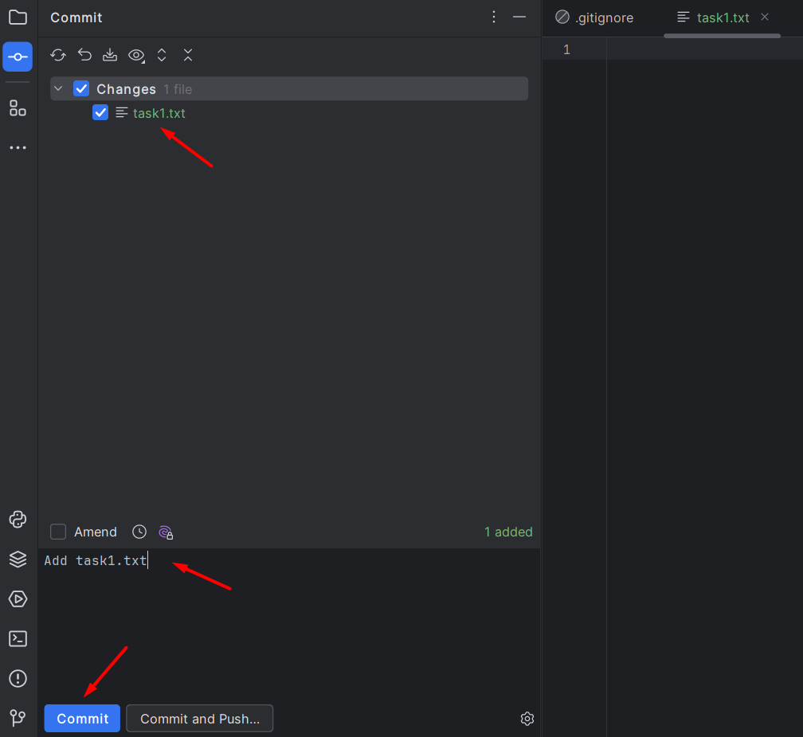

4. Теперь внесите изменения в файл `task1.txt` с текстом
`Начинается дорожка, но прошел я лишь немножко.`

    В меню `Commit` файлик подсветился синим - теперь он изменённый.
5. Выделите файлик и сделайте коммит с описанием `Add text in task1.txt`

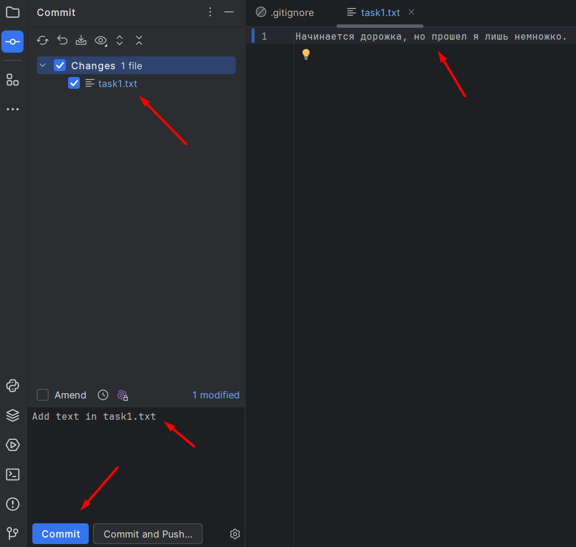

6. Перейдите в меню `Git` (значок подсвечен на изображении внизу слева). Здесь отражена вся информация о ваших коммитах.

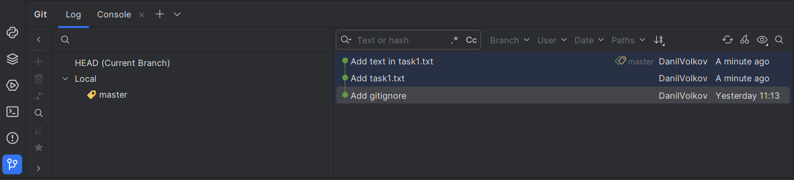

7. Вернитесь на коммит назад с помощью команды `Reset` и режима `Mixed`.
Состояние файла станет "изменённый".

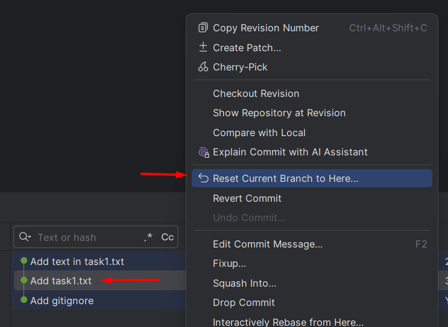

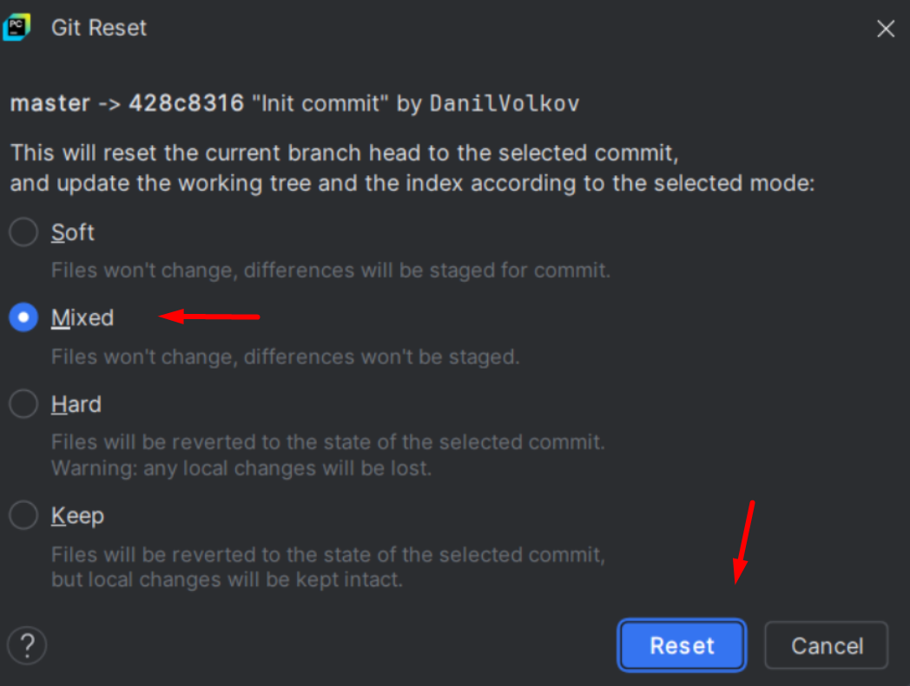

8. Сделайте коммит с файликом task1.txt с описанием `Update task1.txt`
9. Вернитесь на коммит назад с помощью команды `Reset` и режима `Hard` - в таком случае все изменения и новые файлы будут утеряны.

   Это может помочь, если код полностью сломался и вы не знаете, где ошибка. **Применяйте с крайней осторожностью!**
10. Скопируйте в файлик `task1.txt` следующий текст: `Продолжается дорожка и прошел я уже "множко".`
11. Сделайте коммит с описанием `Add text in task1.txt`
11. Создайте файл `task2.txt`, добавьте его в stage git и внесите в него строку `Параллельная дорожка начинается немножко.`
12. Удалите текст из файла `task1.txt`
12. Перейдите в меню `Commit`, там вы увидете 2 файлика - изменённый и только что добавленный.
Сделайте коммит с описанием `Fix task1.txt and Add task2.txt`

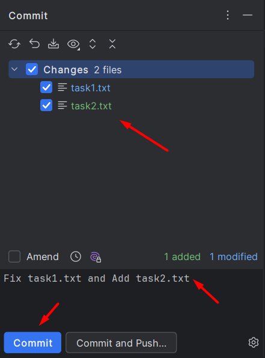

13. Измените содержимое файла `task2.txt` на `Параллельная дорожка продолжается ...`
14. Теперь верните файл `task2.txt` в исходное состояние с помощью Rollback.

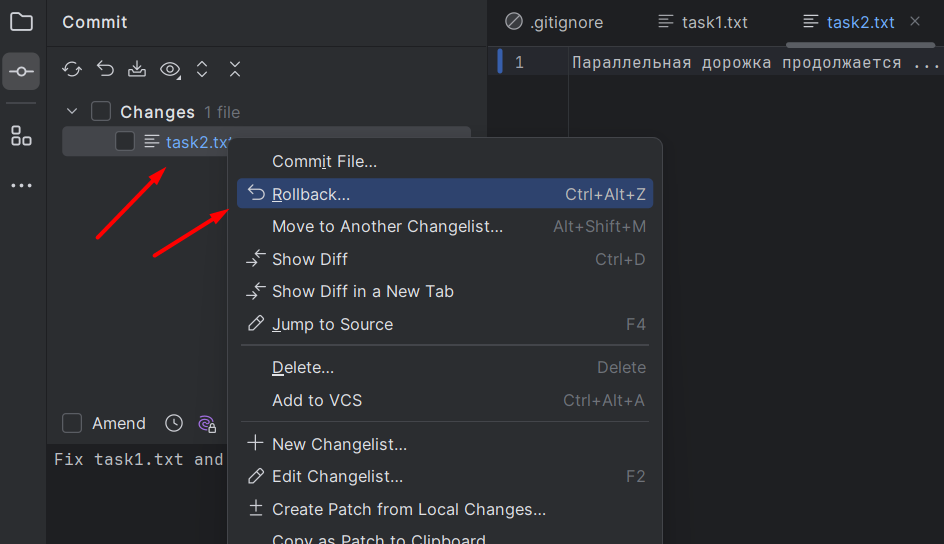

15. Удалите файл `task2.txt`. Сделайте коммит с описанием `Delete task2.txt`

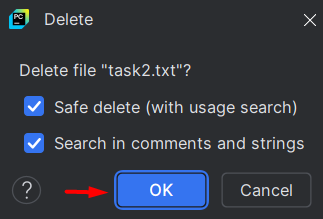

16. Измените содержимое файла `task1.txt` на `Вот закончилась дорожка, изучил я git немножко.`
Сделайте коммит с описанием `Update text in task1.txt`

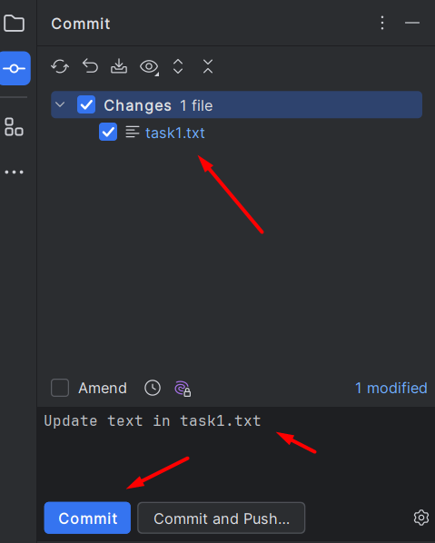

17. Приложите в iSpring скриншот PyCharm с меню `Git` и файловой структурой. Пример:

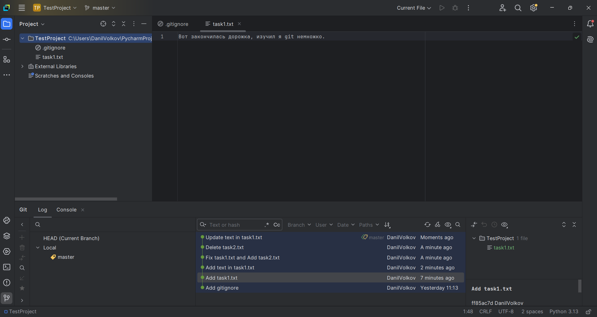

---

### Полезные материалы

- Руководство по работе с Git и GitHub через интерфейс PyCharm: https://teletype.in/@kurilkv/CodimGitHub#H084