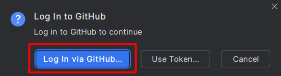
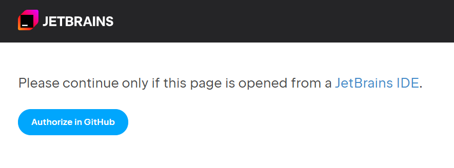
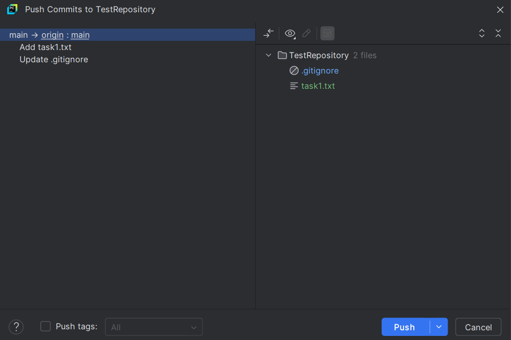
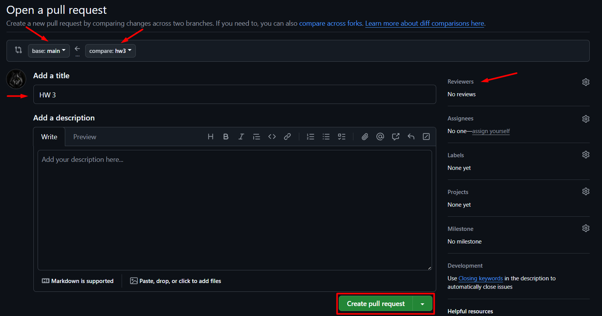
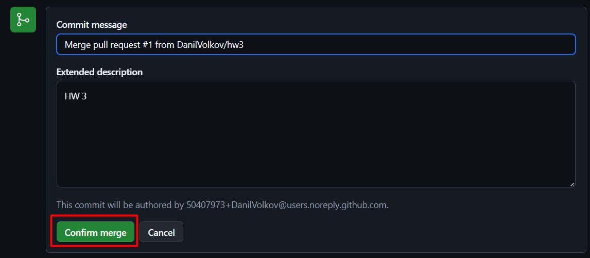

# Домашнее задание 3

Домашнее задание состоит из 3 частей:
1. Создание репозитория в GitHub
2. Клонирование репозитория
3. Отработка взаимодействия

---

### Часть 1: Создание репозитория в GitHub

1. Перейдите в GitHub: https://github.com/
2. Нажмите на кнопку `New` для создания репозитория.

3. Настройте новый репозиторий:
    - Введите имя репозитория: `TestRepository`
    - Выберите `Private`
    - Добавьте файлик `.gitignore` для Python
    - Нажмите кнопку `Create repository`

Поздравляем! Репозиторий создан!

---

### Часть 2: Клонирование репозитория

1. В новом репозитории нажмите кнопку `Code` и скопируйте HTTPS-ссылку.

2. Откройте PyCharm и в меню `File` выберите `Project from Version Control...`

3. Вставьте скопированный URL и нажмите `Clone`

4. При первом подключении из PyCharm потребуется авторизация в GitHub.
5. Для авторизации можно использовать токен или вход через github.
Выбираем вход через GitHub.

6. Данная кнопка перенаправляет на web-страницу с авторизацией.
На странице нужно нажать кнопку `Authorize in GitHub`

7. После должно появиться сообщение об успешной авторизации.

8. Теперь можно перейти в PyCharm и открыть проект.

9. В открытом проекте должен лежать 1 файлик - `.gitignore`

10. Теперь GitHub и PyCharm связаны.

>Добавить или удалить аккаунт можно в пункте меню `Settings` -> `Version Control` -> `GitHub`

---

### Часть 3: Отработка взаимодействия

1. Откройте файл `.gitignore`. Найдите пункт `PyCharm`. В данном пункте раскомментируйте строку `.idea/`.
Готовый вариант должен выглядеть как на изображении ниже.

2. Сделайте коммит с описанием `Update .gitignore`
3. Создайте файл `task1.txt` и добавьте его в отслеживаемые.
4. Добавьте в файл `task1.txt` содержимое: `Это было бы мученье, но я настроил подключение`
5. Сделайте коммит с описанием `Add task1.txt`
6. Теперь при помощи команды Push отправьте изменения в локальной ветке main на удаленный репозиторий, также в ветку main.

7. Перейдите в GitHub, обновите страницу и проверьте изменения.

> Запомните! Отправлять коммиты сразу в ветку main - плохая практика!
> В дальнейшем, в процессе выполнения домашних заданий на курсе так делать запрещено!
> 
> Если в ходе выполнения домашних работ вы случайно зальете изменения сразу в ветку main,
> нужно будет откатить изменения и сделать корректный Pull Request.

8. Перед тем, как создавать новую ветку, нужно загрузить обновленную ветку main из удаленного репозитория.
Для этого нажмите на ветку main и выберите `Update Project...`

9. Создайте ветку `hw3` от ветки `main`

10. Проверьте, что вы находитесь на ветке `hw3`

11. Создайте файл `task2.txt` со следующим содержимым: `Изучаю, познаю, до конца точно дойду` и добавьте его в stage git.
12. Сделайте коммит с описанием `Add task2.txt` и отправьте изменения на удаленный репозиторий в GitHub.
Данные действия можно сделать одной кнопкой - `Commit and Push...`

13. Убедитесь, что на удаленном репозитории будет создана новая ветка `hw3`

14. Перейдите в GitHub и откройте Pull Request (PR).

15. Настройте PR. Убедитесь, что изменения будут отправляться из ветки `hw3` в ветку `main`.
Введите название `HW 3`. В меню `Reviewers` вы в будущем будете выбирать ваших преподавателей.
Пока что оставьте это поле без изменений. Нажмите кнопку `Create pull request`

16. В последующих домашних заданиях кнопку `Merge pull request` можно будет нажимать **только после того, как преподаватели одобрят PR!**

> Если вы случайно (хотя нужно нажать 2 кнопки) смержите ветки до одобрения преподавателей, то
> можно будет откатить PR путем создания нового.
> 
> Подробнее см. [Reset_PR.md](Reset_PR.md)

17. В данном домашнем задании PR не проверяется, поэтому нажмите на кнопку `Merge Pull Request`.
После можете ввести сообщение к коммиту, описание и нажать кнопку `Confirm merge`

18. Теперь можно безопасно удалить ветку `hw3`  и на Github, и в локальном репозитории.

19. Перейдите в PyCharm и переключитесь на ветку main

20. Файлик `task2.txt` пропал, так как в локальной ветке main еще нет изменений из ветки main на Github.
21. Обновите локальную ветку main с помощью `Update Project...`

22. Приложите в iSpring скриншот PyCharm с меню `Git` и файловой структурой.
Пример:

23. Также приложите скриншот с GitHub.
Пример:

---

### Полезные материалы:

- Интерактивный курс по git: https://learngitbranching.js.org/?locale=ru_RU.
- Руководство по работе с Git и GitHub через интерфейс PyCharm: https://teletype.in/@kurilkv/CodimGitHub#H084
- [Что делать если отправил изменения сразу в ветку main](Reset_commit.md)
- [Что делать если сделал Merge pull request до проверки](Reset_PR.md)