# Что делать, если сделал Merge pull request до проверки

> Допустим есть PR, который уже залит в main

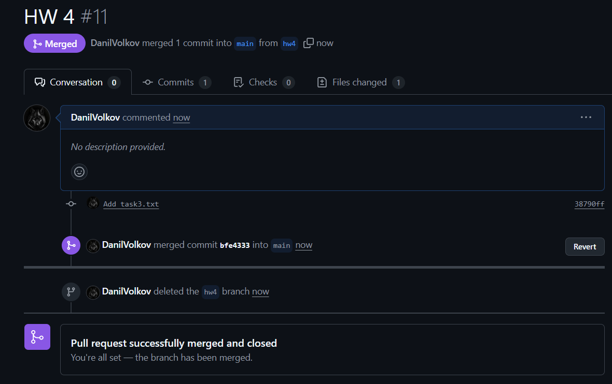

1. В PyCharm перейдите на ветку `main`, обновите её. Откатите изменения с помощью метода `Hard`
до того момента, 
когда была создана ветка, влитая в main.

> В примере коммит `Add task3.txt` был сделан уже на ветке `hw4`. Поэтому
> нужно откатиться на один коммит ниже. 

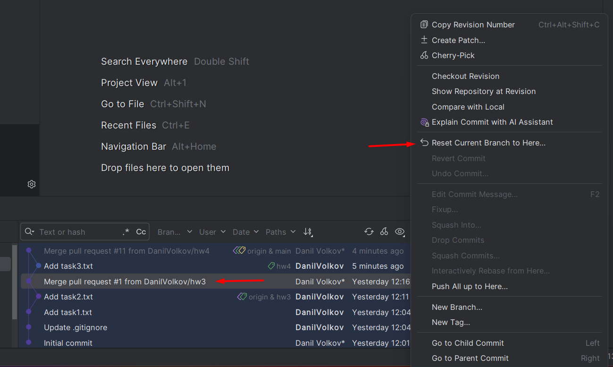

2. Отправьте изменения с локальной ветки main в удалённую с помощью форсированного пуша.

> Форсированный пуш может быть не доступен в ветку `main` из-за правил безопасности.
> Отключите их на время.
> 
> Зайдите в настройки `Settings -> Version Control -> Git`, сохраните текст из поля 
`Protected branches` и очистите его.

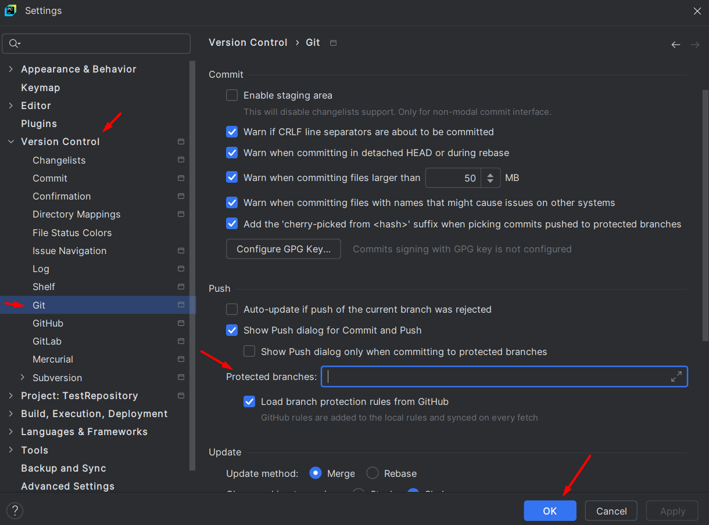

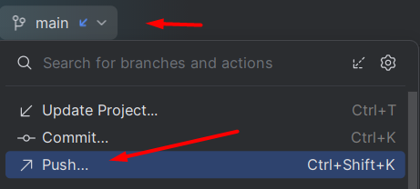

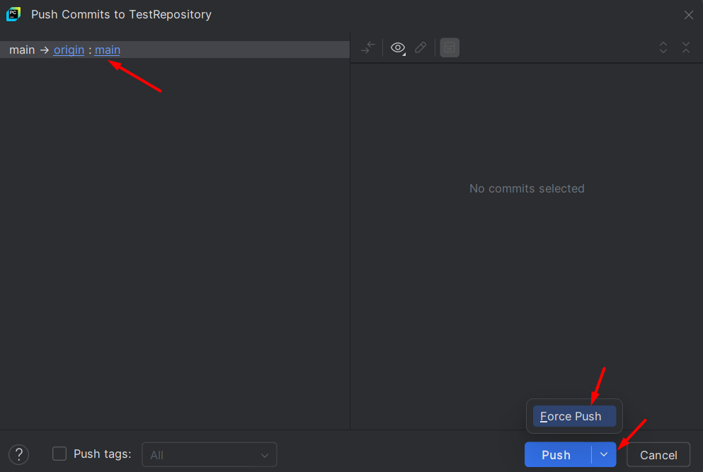

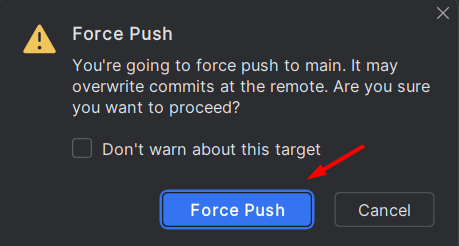

3. Отправьте нужную ветку в удалённый репозиторий для возможности создания PR.

> В примере ветку `hw4` нужно отправить на удалённый репозиторий.

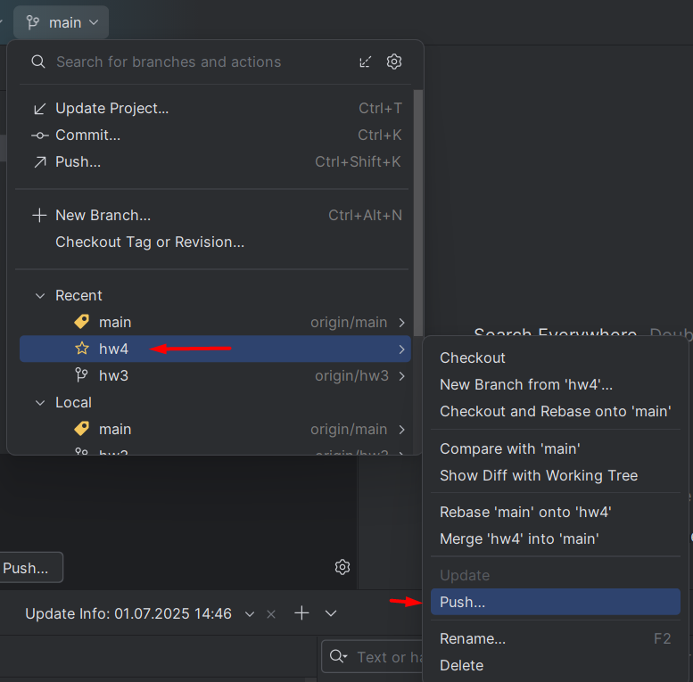

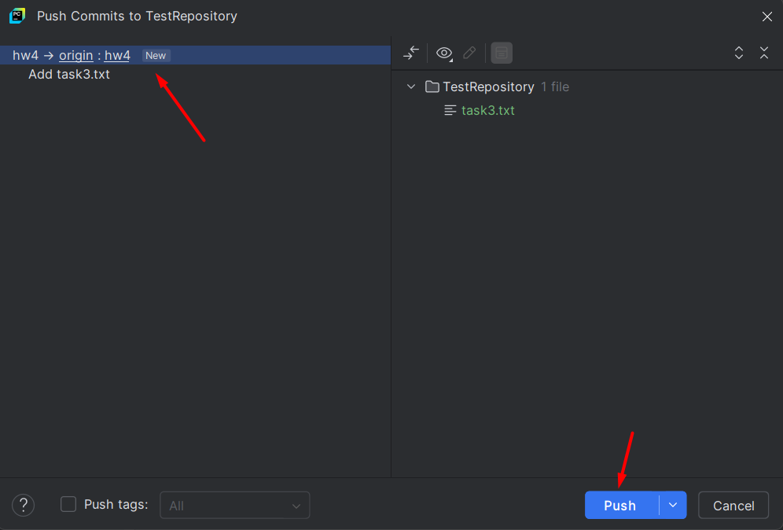

4. Создайте новый PR из ветки `hw4` в `main`

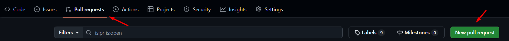

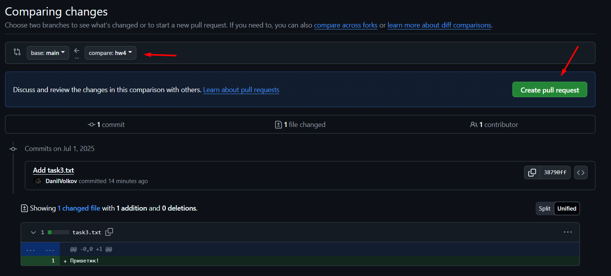

5. Укажите преподавателей для проверки RP.

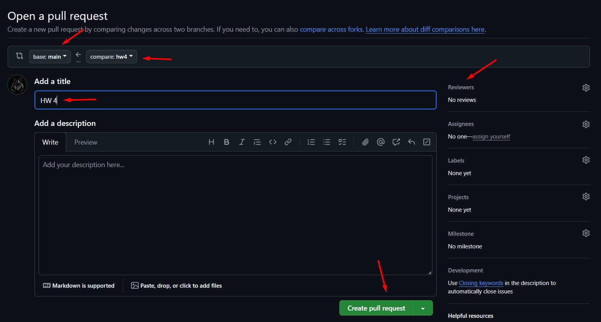

> Задайте правила безопасности для веток.
> Зайдите в настройки `Settings -> Version Control -> Git`, заполните поле
`Protected branches` теми значениями, которые в нём были.