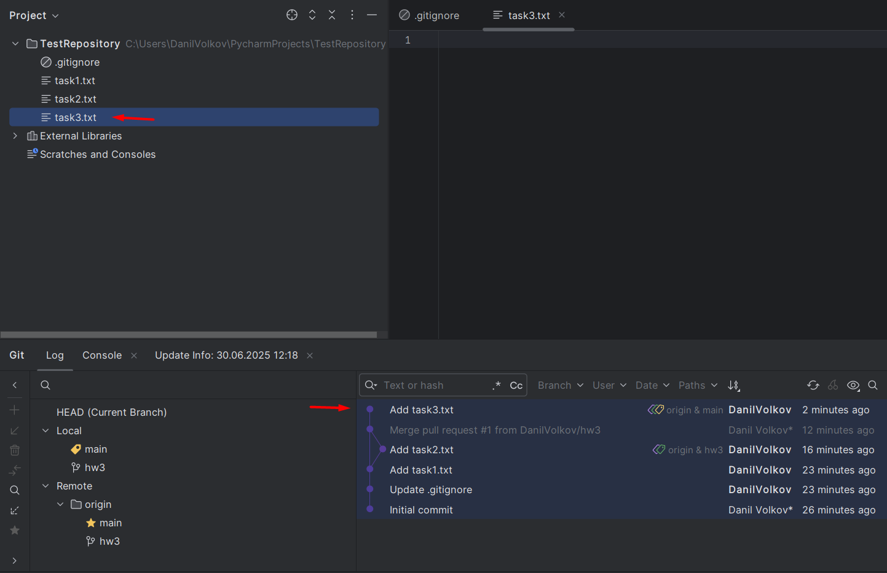
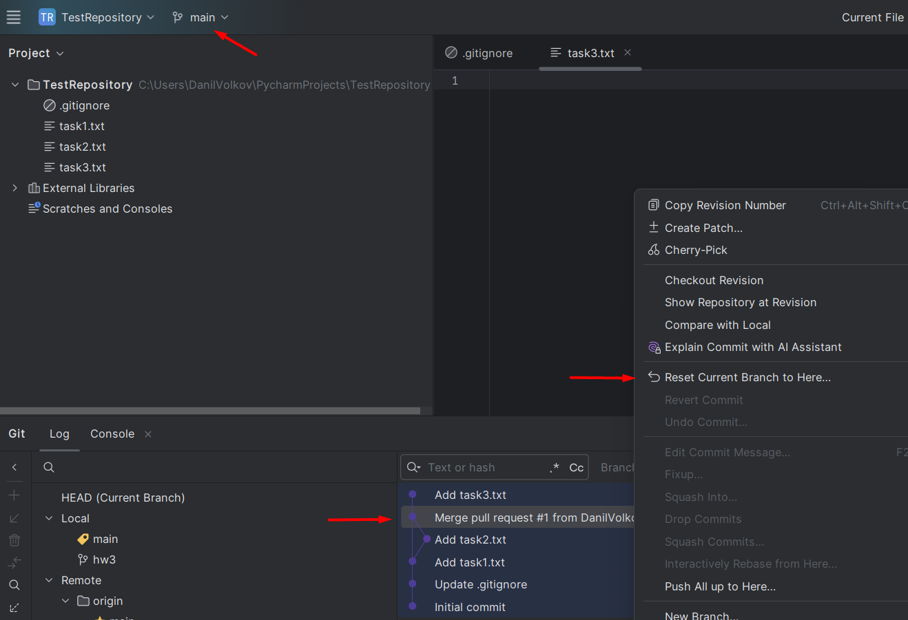
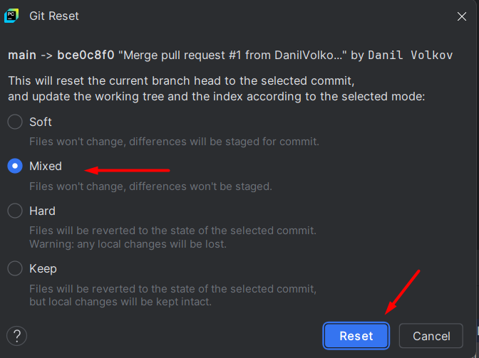
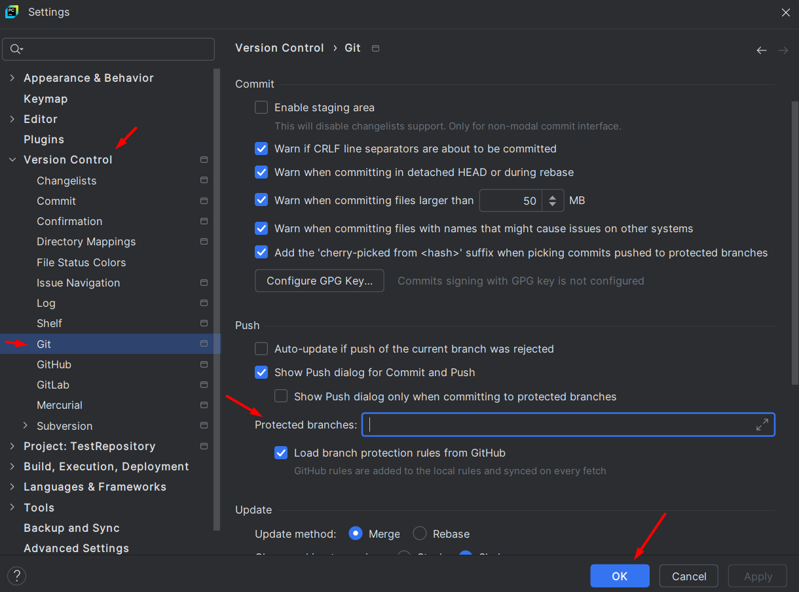
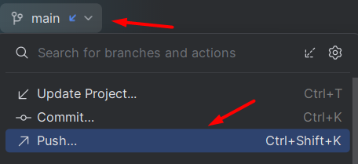
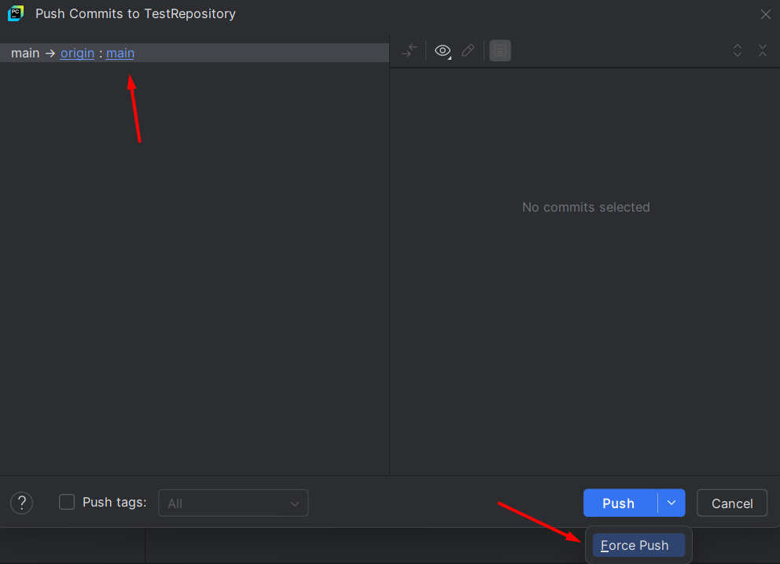
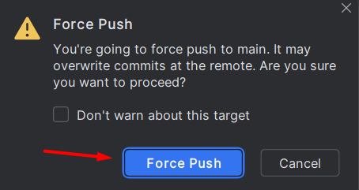

# Что делать, если отправил изменения сразу в ветку main

> Допустим есть файл task3.txt, который был отправлен сразу в ветку `main` без
создания PR.

1. Убедитесь, что выбрана ветка `main`
2. Откройте меню `Git` и вернитесь на коммит назад с помощью метода `Mixed`

> Таким образом файлик переходит в состояние "Неотслеживаемый", если он был создан
или в состояние "Измененный", если он был изменен.

3. Зайдите в настройки `Settings -> Version Control -> Git`, сохраните текст из поля 
`Protected branches` и очистите его.

> Теперь можно принудительно заменить содержимое ветки в удалённом репозитории тем, 
что лежит в локальном.

4. Нажмите на ветку и выберите `Push`, нажмите на стрелку рядом с `Push` и выберите `Force push`

5. Нажмите на кнопку `Force push`

6. Зайдите в настройки `Settings -> Version Control -> Git`, заполните поле
`Protected branches` теми значениями, которые в нём были.

7. Таким образом удаленная и локальная ветка main откатились на коммит назад,
изменения в файлах сохранились.

8. Теперь можно создать новую ветку от ветки main, сделать коммит с данными файлами в новой ветке
и открыть PR.

> Внимание! Команда `git push -f` является опасной, так как есть риск потерять часть истории коммитов.

> Применять её при командной разработке, когда в один и тот же репозиторий могут отправлять коммиты разные люди, категорически не рекомендуется. 

> В данном курсе вы единственный, кто отправляет коммиты в свой репозиторий, поэтому в качестве исключения, эту опцию применить можно.

> Всегда следите за тем, чтобы локальная ветка была синхронизирована с удалённой!

