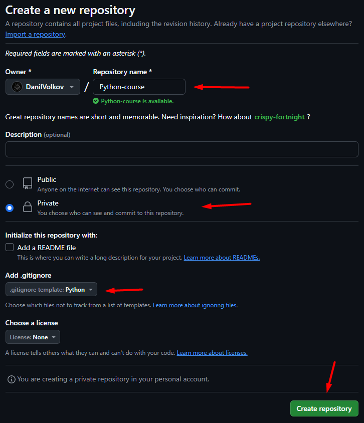
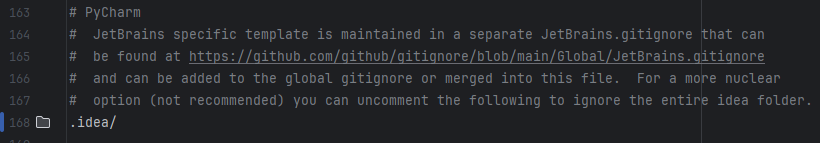
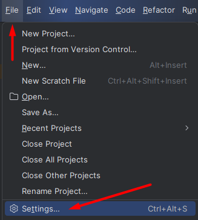
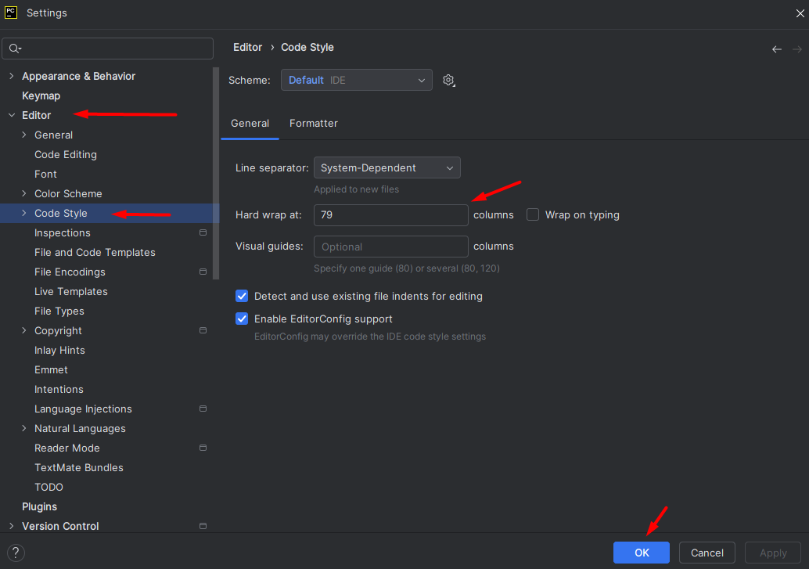
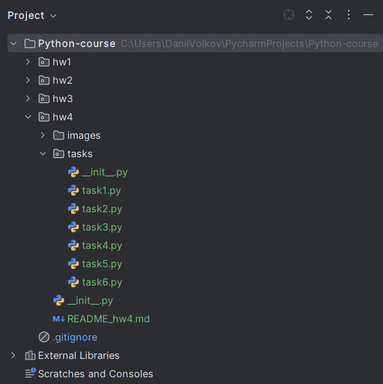

# Домашнее задание 4

Домашнее задание состоит из 4 частей:
1. Создание репозитория для домашних заданий на курсе
2. Настройка PyCharm для разработки
3. Решение задач
4. Создание PR

---

### Часть 1: Создание репозитория для задач

1. Зайдите в GitHub и создайте приватный репозиторий с именем `Python-course`.
   Поставьте галочку создания файлика `.gitignore`

2. Добавьте преподавателей в соавторы (collaborators) данного репозитория.
Логины для добавления: `DanilVolkov` и `mav1984`

3. Клонируйте данный репозиторий в PyCharm.

---

### Часть 2: Настройка PyCharm для разработки

1. Добавьте игнорирование папки `.idea` в файл `.gitignore`

2. Измените следующие настройки в PyCharm:

- Hard wrap (вертикальная черта количества символов)

3. Перейдите в iSpring, скачайте архив и разархивируйте его.
4. Откройте папку с архивом и скопируйте все файлы и папки, лежащие в нём в PyCharm.

5. Добавьте все новые файлы и папки в stage git, выполните commit.
При помощи push отправьте изменения на удаленный репозиторий в ветку `main` 

---

### Часть 3: Решение задач

1. Создайте новую ветку от `main` под названием `hw<номер дз>`. 
Для данного домашнего задания название ветки будет `hw4`
2. Переключитесь на данную ветку.
3. Решите задачи в файлах task1.py, task2.py и т.д. 

> Фиксируйте изменения коммитом после каждой задачи!

> Запускайте код. Проверяйте решение.

---

### Часть 4: Создание PR

1. При помощи push отправьте изменения на удаленный репозиторий в ветку `hw4` 
2. Создайте PR с названием `HW 4`. Проверьте, что изменения из ветки `hw4` вливаются в ветку `main`
3. Добавьте в `Reviewers` преподавателей и **ждите проверки**.

---

# Информация о задачах

В течение курса вы будете получать баллы за свою успеваемость. 
Баллы считаются следующим образом:

| 📋 Условие                                         | 🎯 Баллы |
|----------------------------------------------------|:--------:|
| Решение обязательной задачи                        |    1     |
| Решение задачи повышенной сложности                | 2 или 3  |
| *Сдача дз до дедлайна                              |    1     |
| За активность на лекциях (начисляет преподаватель) |   до 3   |
| За лучшие решения задач (начисляет преподаватель)  |   до 3   |
| Финальный проект                                   |    ?     |

> *Домашнее задание считается отправленным до дедлайна, если:
> - Решены все обязательные задачи
> - Алгоритм решения задачи эффективен 
> - Код написан с соблюдением всех требований
> 
> Задания могут быть отправлены на доработку. В этом случае время сдачи 
> домашнего задания приравнивается к первой попытке, только если были соблюдены все условия выше.

В названии задачи можно найти ее категорию (обязательная или дополнительная) и количество баллов.

Например: "Алфавит +1". Задача называется "Алфавит" и дает 1 балл -  эта задача является обязательной.

Другой пример: "Список +2". Задача называется "Список" и дает 2 балла.
Так как количество баллов больше единицы, это значит, что она является задачей с
повышенной сложностью и необязательна для выполнения.

> Если у преподавателей возникают подозрения, что решение задачи списано или было дано другим для списывания - баллы за него не начисляются.
> 
> Преподаватель вправе потребовать полностью переделать такое решение.

---

# Требования к коду

1. Имена переменных нужно писать только на английском языке.

| ❌ Некорректно | ✅ Правильно     |
|---------------|-----------------|
| chislo        | number          |
| min_ostatok   | minimum_balance |
| resultat      | result          |

2. Между переменными, числами и знаками должны быть пробелы.

| ❌ Некорректно   | ✅ Правильно      |
|-----------------|------------------|
| a=3             | a = 3            |
| print(a+b)      | print(a + b)     |
| a + b//(3*c)    | a + b // (3 * c) |